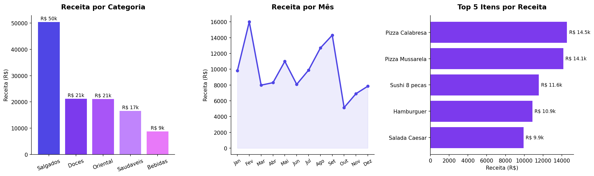

# Análise de Vendas — Delivery de Refeições

Análise exploratória de dados de um serviço de delivery multi-categoria, cobrindo quase 3 anos de operação. O objetivo foi entender quais itens e categorias sustentam a receita do negócio, como as vendas se comportam ao longo do tempo e onde estão as oportunidades de otimização do cardápio.

---

## Perguntas respondidas

- Quais categorias do cardápio geram mais receita?
- Quais itens lideram em volume de pedidos e em faturamento?
- Existe sazonalidade nas vendas? Quais meses performam melhor?
- Como tratar dados ausentes sem distorcer os resultados da análise?

---

## Principais resultados

| Indicador | Resultado |
|---|---|
| Receita total | R$ 117.982 |
| Período analisado | Jan/2023 – Set/2025 |
| Total de pedidos | 430 |
| Itens vendidos | 6.547 |
| Ticket médio diário | R$ 337 |
| Categoria líder | Salgados (R$ 50.393 — 43% da receita) |
| Item mais vendido (volume) | Hamburguer (479 unidades) |
| Item maior faturamento | Pizza Calabresa (R$ 14.546) |
| Melhor mês | Fevereiro (R$ 16.012) |

---

## Insights de negócio

**Salgados domina, mas Doces e Oriental são mais eficientes por item.** Salgados representa 43% da receita, mas a Pizza Calabresa e a Pizza Mussarela sozinhas respondem por R$ 28,7k — quase 25% de toda a receita do negócio. Otimizar a disponibilidade e o preço desses dois itens tem impacto direto no faturamento.

**O Hamburguer é o item mais pedido, mas não é o mais lucrativo.** Com 479 unidades vendidas, ele lidera em volume — mas gera R$ 10,9k em receita, contra R$ 14,5k da Pizza Calabresa com menos pedidos. Isso indica que o preço unitário faz diferença e pode justificar revisão de precificação.

**Fevereiro e setembro são os picos de receita.** O padrão mensal mostra dois picos claros (fev e set) e uma queda em outubro. Esse comportamento pode orientar promoções e reposição de estoque nos meses mais fracos.

**Bebidas têm o menor faturamento (R$ 8,7k), mas alto potencial de margem.** É uma categoria frequentemente subutilizada em deliveries — combo estratégico com os itens líderes pode aumentar o ticket médio por pedido.

---

## Destaques técnicos

- Tratamento de valores ausentes em `Quantidade` com imputação pela média
- Remoção de registros sem `Preco_Unitario` para não distorcer a receita calculada
- Feature engineering: criação da coluna `Receita_Item` a partir de quantidade × preço
- Merge entre tabelas de pedidos e cardápio para análise por categoria
- Análise temporal com extração de mês a partir da coluna de data

---

## Visualizações



---

## Stack utilizada

- **Python 3** — linguagem principal
- **Pandas** — manipulação, limpeza e agregação de dados
- **NumPy** — análise estatística (percentis)
- **Matplotlib** — visualizações
- **Jupyter Notebook** — ambiente de análise

---

## Como executar

```bash
git clone https://github.com/dieegomarcelo/analise-delivery-rocketseat.git
cd analise-delivery-rocketseat
pip install pandas numpy matplotlib
jupyter notebook analise-delivery-rocketseat.ipynb
```

Os arquivos `pedidos.csv` e `cardapio.csv` já estão incluídos no repositório.

---

## Sobre o projeto

Este projeto faz parte do meu portfólio de análise de dados. Outros projetos disponíveis no [perfil do GitHub](https://github.com/dieegomarcelo).

